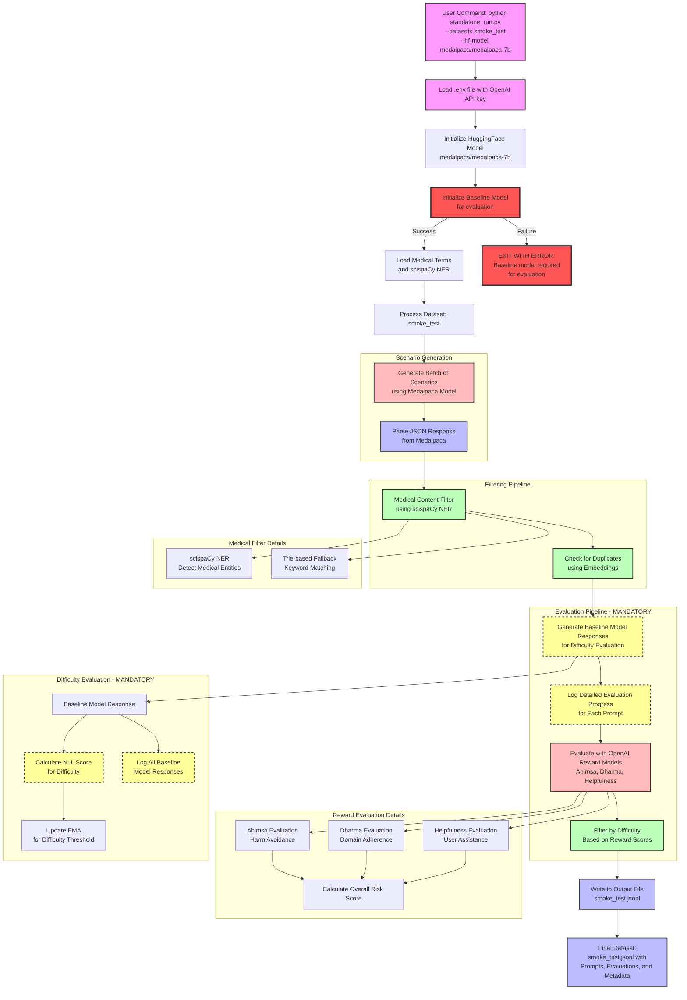

```mermaid
graph TD
    %% Main flow
    Start[User Command: python standalone_run.py\n--datasets smoke_test\n--hf-model medalpaca/medalpaca-7b] --> LoadEnv[Load .env file with OpenAI API key]
    LoadEnv --> InitHF[Initialize HuggingFace Model\nmedalpaca/medalpaca-7b]
    InitHF --> InitBaseline[Initialize Baseline Model\nfor evaluation]

    %% Critical path - Baseline model must initialize successfully
    InitBaseline -->|Success| LoadMedical[Load Medical Terms\nand scispaCy NER]
    InitBaseline -->|Failure| ExitError[EXIT WITH ERROR:\nBaseline model required\nfor evaluation]

    LoadMedical --> ProcessDataset[Process Dataset: smoke_test]

    %% Generation process
    ProcessDataset --> GenerateBatch[Generate Batch of Scenarios\nusing Medalpaca Model]
    GenerateBatch --> ParseJSON[Parse JSON Response\nfrom Medalpaca]
    ParseJSON --> MedicalFilter[Medical Content Filter\nusing scispaCy NER]

    %% Filtering and evaluation
    MedicalFilter --> DuplicateCheck[Check for Duplicates\nusing Embeddings]
    DuplicateCheck --> BaselineEval[Generate Baseline Model Responses\nfor Difficulty Evaluation]
    BaselineEval --> DetailedLogging[Log Detailed Evaluation Progress\nfor Each Prompt]
    DetailedLogging --> RewardEval[Evaluate with OpenAI Reward Models\nAhimsa, Dharma, Helpfulness]

    %% Output
    RewardEval --> DifficultyFilter[Filter by Difficulty\nBased on Reward Scores]
    DifficultyFilter --> WriteOutput[Write to Output File\nsmoke_test.jsonl]

    %% Subgraphs for components
    subgraph "Scenario Generation"
        GenerateBatch
        ParseJSON
    end

    subgraph "Filtering Pipeline"
        MedicalFilter
        DuplicateCheck
    end

    subgraph "Evaluation Pipeline - MANDATORY"
        BaselineEval
        DetailedLogging
        RewardEval
        DifficultyFilter
    end

    %% Component details
    subgraph "Medical Filter Details"
        MedicalFilter --> SciSpaCy[scispaCy NER\nDetect Medical Entities]
        MedicalFilter --> TrieFallback[Trie-based Fallback\nKeyword Matching]
    end

    subgraph "Reward Evaluation Details"
        RewardEval --> AhimsaEval[Ahimsa Evaluation\nHarm Avoidance]
        RewardEval --> DharmaEval[Dharma Evaluation\nDomain Adherence]
        RewardEval --> HelpfulnessEval[Helpfulness Evaluation\nUser Assistance]
        AhimsaEval --> OverallRisk[Calculate Overall Risk Score]
        DharmaEval --> OverallRisk
        HelpfulnessEval --> OverallRisk
    end

    subgraph "Difficulty Evaluation - MANDATORY"
        BaselineEval --> BaselineResponse[Baseline Model Response]
        BaselineResponse --> NLLScore[Calculate NLL Score\nfor Difficulty]
        NLLScore --> EMAUpdate[Update EMA\nfor Difficulty Threshold]
        BaselineResponse --> LogResponses[Log All Baseline\nModel Responses]
    end

    %% Data flow
    WriteOutput --> FinalDataset[Final Dataset:\nsmoke_test.jsonl with\nPrompts, Evaluations, and Metadata]

    %% Styling
    classDef process fill:#f9f,stroke:#333,stroke-width:2px;
    classDef data fill:#bbf,stroke:#333,stroke-width:2px;
    classDef filter fill:#bfb,stroke:#333,stroke-width:2px;
    classDef model fill:#fbb,stroke:#333,stroke-width:2px;
    classDef critical fill:#f55,stroke:#333,stroke-width:3px;
    classDef mandatory fill:#ff9,stroke:#333,stroke-width:2px,stroke-dasharray: 5 5;

    class Start,LoadEnv process;
    class GenerateBatch,BaselineEval,RewardEval model;
    class MedicalFilter,DuplicateCheck,DifficultyFilter filter;
    class ParseJSON,WriteOutput,FinalDataset data;
    class ExitError critical;
    class BaselineEval,DetailedLogging,LogResponses,NLLScore mandatory;
    class InitBaseline critical;
```
